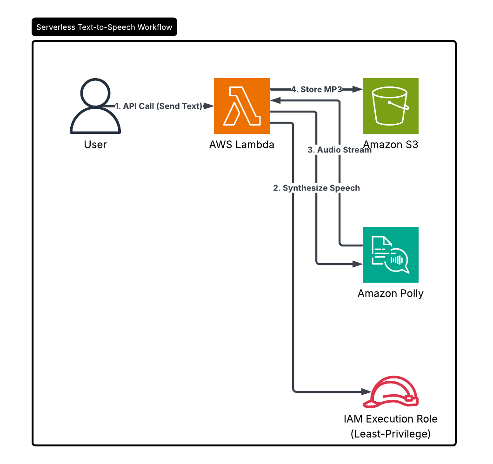

# AWS Portfolio
    This repository contains projects developed as part of my transition into Cloud Technology.
## Certifications & Training
* **AWS Certified Cloud Practitioner** (Passed April 2026)
* **Targeting:** AWS Certified Solutions Architect – Associate (Expected 2026)
* **Skills:** Python (Boto3), Cloud Architecture, AI/ML Integration

---

## Project 1: AI-Powered Daily Task Scheduler
---
    
    ## Project 1: AI-Powered Daily Task Scheduler
    Built using **Amazon PartyRock** (powered by **Amazon Bedrock**).
    
    ### Description
    A generative AI application designed to optimize personal productivity. The app takes user inputs for daily tasks, priority levels, and available time to generate a structured, time-blocked schedule.
    
    ### Key AWS Services & Concepts
    * **Amazon Bedrock:** Leveraged foundation models for natural language processing.
    * **Prompt Engineering:** Optimized system prompts with dynamic variables (@widgets) to ensure accurate scheduling logic.
    * **Rapid Prototyping:** Used PartyRock for agile development and testing of AI workflows.
    
    ### Project Link
    [View the Live App Here](https://partyrock.aws/u/sstraus/XZj8BH4RG/Daily-Task-Scheduler-AI)
    
    ---

### **Key Skills Demonstrated (Project 1):**
* **Generative AI Implementation:** Building functional applications using Foundation Models (FMs).
* **Advanced Prompt Engineering:** Using system-level instructions to control AI logic and output formatting.
* **Rapid Prototyping:** Utilizing AWS specialized tools (PartyRock) to move from concept to a live, shareable application in minutes.

---

## Project 2: AI Video Analysis with Rekognition
**Built using:** Python (Boto3), Amazon Rekognition, and Amazon S3.

### **Description**
This project automates the process of "watching" videos to detect and label objects, scenes, and activities. Unlike static images, video analysis requires asynchronous processing; this script initiates a detection job, monitors its status in real-time, and extracts unique labels once the analysis is complete.

### **Key Skills Demonstrated:**
* **Asynchronous Cloud Workflows:** Implementing polling logic to handle long-running tasks that don't finish instantly.
* **Computer Vision API Integration:** Leveraging deep learning models via AWS Rekognition for automated metadata extraction.
* **Automated Data Processing:** Handling unstructured video data stored in Amazon S3 via the Boto3 SDK.
### Sample Output from Amazon Rekognition:
The Python script successfully processed `AWS Rekognition video.mp4` and asynchronously extracted timestamps and labels in real-time. Here is a sample of the log:
- **Label: Interview** | Time Found: 5500ms
- **Label: Paparazzi** | Time Found: 5500ms
- **Label: Video Camera** | Time Found: 5500ms
- **Label: Photography** | Time Found: 6000ms
---
## Project 3: Serverless AI Text Narrator

Built using **AWS Lambda**, **Amazon Polly**, and **Amazon S3**.
### Description
An event-driven application that converts text into lifelike speech. This project leverages a Node.js Lambda function to process text inputs, synthesize audio via Amazon Polly, and automatically store the resulting MP3 files in a dedicated S3 bucket.

### Key Skills Demonstrated
* **Serverless Logic:** Implementing asynchronous event handling using **Node.js 22.x** and ES Modules.
* **AI Service Integration:** Configuring and calling the **Amazon Polly SDK** for high-quality speech synthesis.
* **Secure Cloud Storage:** Managing automated file uploads to **Amazon S3** with proper content-type headers.
* **IAM Governance:** Creating execution roles with **least-privilege permissions** for cross-service communication.
* ### Project Link
* [View the Source Code here](./Text-Narrator)
---
## Project 4: AI-Powered Multi-Language Translator Bot
**Built using:** Amazon Lex V2, AWS Lambda (Python/Boto3), and Amazon Translate.

### Description
An interactive, event-driven chatbot that provides real-time text translation. This project demonstrates the integration of conversational AI with cloud-native machine learning services, allowing users to translate text into Spanish, German, Italian, or French through a natural chat interface.

### Key Skills Demonstrated
* **Conversational AI Design:** Developed a Lex V2 bot with custom intents and slot elicitation (Language, Text).
* **Serverless Logic:** Wrote a Python Lambda function using the **Boto3 SDK** to bridge the chatbot with translation services.
* **IAM Governance:** Configured least-privilege permissions (`TranslateFullAccess`) for secure service-to-service communication.

### Challenges & Troubleshooting (Overcoming Obstacles)
One of the most valuable parts of this project was navigating real-world technical challenges during the integration phase:

* **The Challenge:** Encountered a persistent "Something went wrong" error during fulfillment.
* **The Investigation:** Debugged the Lambda logs in CloudWatch to find a `KeyError`. I identified a case-sensitivity mismatch between the Lex Slot names (`Language`/`Text`) and the Python dictionary keys in the code.
* **The Solution:** Standardized all slot references to match the Lex V2 JSON structure, specifically targeting the `['value']['interpretedValue']` path to ensure the Lambda received the actual user string rather than the raw metadata object.

* **The Challenge:** Resolved a `SubscriptionRequiredException` that blocked API calls to Amazon Translate.
* **The Solution:** Verified account activation status and ensured the IAM Execution Role had the specific service-linked permissions required to invoke the Translate API.
### Project Link
* [View the Source Code here](https://github.com/sstraus23/AWS-Portfolio/blob/main/Text-Translator/Lambda_function.py)

